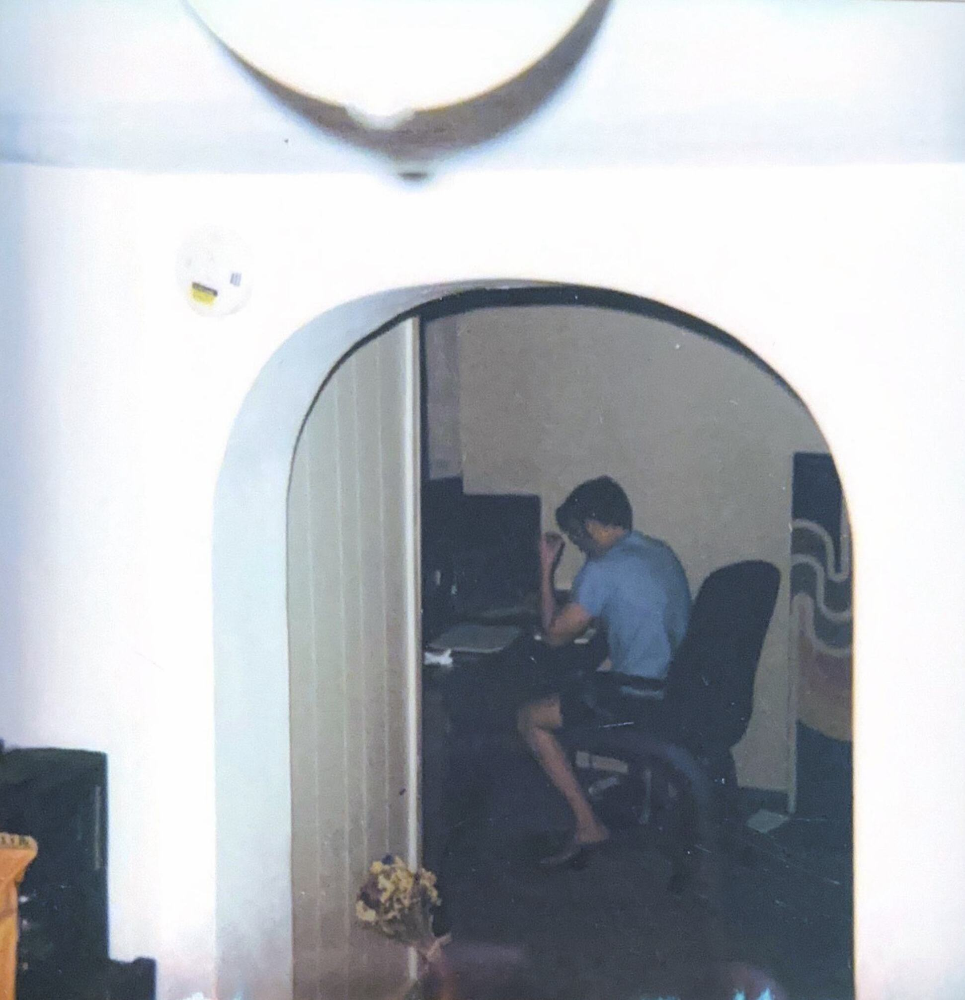
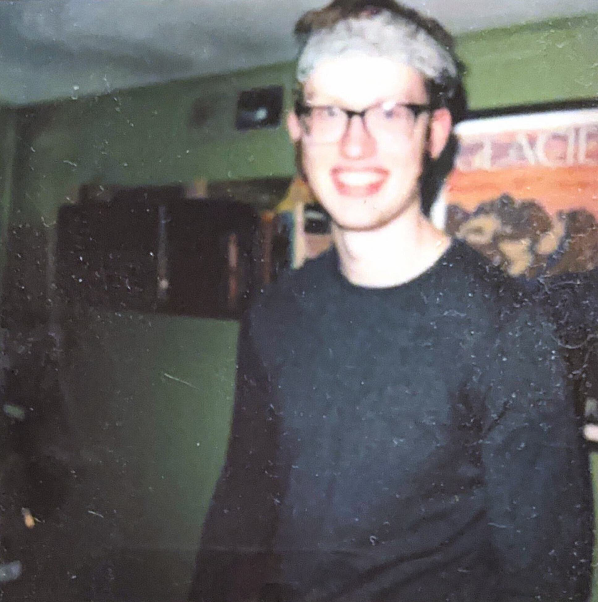

Lorn Jaeger - 

<a href="about.html">about</a> | 
<a href="https://github.com/lorn-jaeger">code</a> | 
<a href="contact.html">contact</a> | 
<a href="log.html">log</a> | 
<a href="reading.html">reading</a>

___
 

### Introduction

Hello and welcome to my web page! My name is Lorn. I am currently and mathematics and computer science student at the University of Montana. I mostly program, build things out of wood, and hang out with my wife.

I was inspired to start this site as a result of the many independent websites I visited in the course of learning to program. You will probably see elements of them in my site. Here is an incomplete 
<a href=links.html>list</a>
of them.

---

### Other Stuff
jfkdjf

---

<a href="home.html">prev</a> | <a href="home.html">home</a> | <a href="home.html">next</a>
